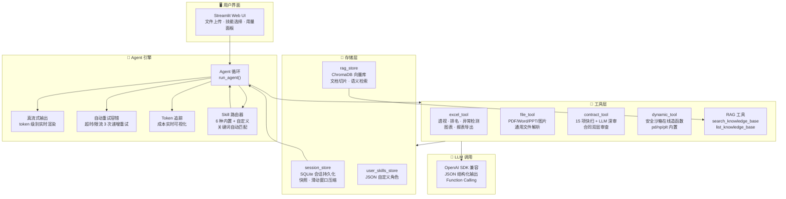
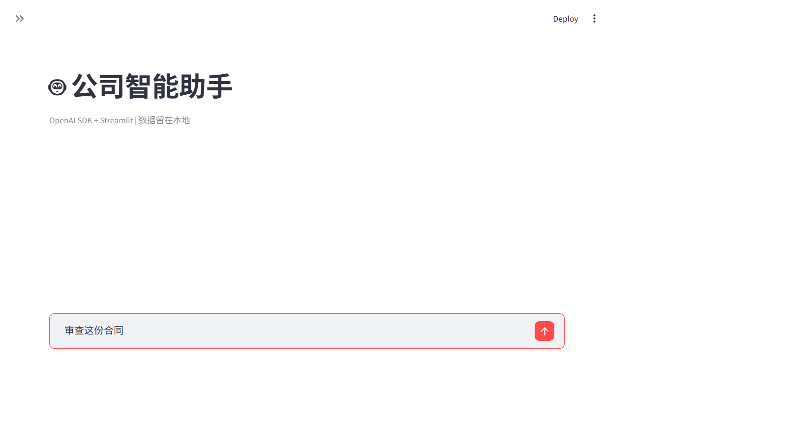

# 🧠 CompanyAgent — 公司内部智能 Agent

基于 **OpenAI SDK + Streamlit + Function Calling** 的企业级智能助手。上传数据、描述需求，自动分析并生成报告。

## ✨ 核心能力

### 🧠 智能分析

- **数据深度分析** — 麦肯锡/BCG 三阶框架（是什么→为什么→所以呢），透视、排名、异常检测、多 Sheet 对账
- **合同双层审查** — 15 项关键词快扫 + LLM 语义深审（中英文/否定句式/附件引用/不对等条款）
- **智能报告生成** — 自动大纲规划 → 逐段扩写 → 排版校对 → Word + PDF 双格式导出
- **通用文件解析** — PDF 全文搜索/分段精读、Word、PPT、图片、HTML、ZIP

### 🔬 技术亮点

- **RAG 知识库** — ChromaDB 向量检索，上传文档自动切片索引，语义搜索精准定位条款
- **Agentic 文档深研** — LLM 自主多步检索 + 交叉验证 + 来源追溯，像研究员一样工作
- **动态工具创建** — LLM 在安全沙箱内在线造新函数（内置 pd/np/plt），突破预设工具限制
- **真流式输出** — token 级别实时渲染，不用等完整响应，长报告也能边看边等
- **结构化输出** — JSON 模式强制合法格式，Skill 配置一键生成
- **自动重试容错** — 超时/限流/网络中断自动等间隔重试，用户无感知
- **并行工具调度** — ThreadPoolExecutor 最多 8 线程并行，响应时间大幅缩短
- **自审查机制** — 初稿 12 项质量核验（数据溯源/三阶穿透/套话清理/排版规范）

### 👤 用户体验

- **开箱即用** — 双击 `启动Agent.bat` 一键启动，`安装依赖.bat` 自动配置环境
- **智能 Skill 路由** — 说"快速看一下"自动切摸底模式，说"查一下合同"自动切文档深研
- **用量可视化** — 侧边栏实时显示 Token 消耗和估算成本，心中有数
- **后台无感索引** — 上传文件即刻可用，向量化在后台静默完成，不阻塞操作
- **会话不丢失** — SQLite 持久化 + 分析快照 + 滑动窗口压缩，刷新不丢、链接可分享
- **自定义角色** — AI 辅助生成专属 Skill，关键词自动匹配，侧边栏一键切换

## 🏗️ 架构





## 📦 安装

双击 `安装依赖.bat`（自动检测 Python → 安装依赖 → 配置引导），或手动：

```bash
pip install -r requirements.txt
```

## 🚀 启动

双击 `启动Agent.bat`，浏览器访问 `http://localhost:8501`。
首次在侧边栏填写 API Key 即可。

## 📁 项目结构

```
├── agent.py              # 主入口：Streamlit UI + Agent 循环
├── config.py             # LLM 与企业微信配置
├── skills.py             # 内置技能定义 + 用户 Skill 合并
├── session_store.py      # 会话持久化 + 快照 + 上下文压缩
├── rag_store.py          # RAG 知识库：向量检索 + 文档索引
├── user_skills_store.py  # 用户自定义 Skill 存储（JSON 持久化）
├── requirements.txt      # Python 依赖
├── 安装依赖.bat           # 首次安装脚本
├── 启动Agent.bat          # 日常启动脚本
├── .gitignore
├── tools/
│   ├── excel_tool.py     # Excel/CSV 全生命周期工具
│   ├── file_tool.py      # 通用文件解析（PDF/Word/PPT/图片等）
│   ├── contract_tool.py  # 合同双层审查引擎
│   └── dynamic_tool.py   # 运行时动态工具管理器
└── docs/                 # 用户手册 + 开发手册 + 图表源文件
```

## 🔧 配置

编辑 `config.py` 或通过环境变量：

| 变量 | 说明 | 默认值 |
|------|------|--------|
| `OPENAI_API_KEY` | LLM API 密钥 | — |
| `OPENAI_BASE_URL` | API 地址 | `your-api-url` |
| `OPENAI_MODEL` | 模型名称 | `your-model` |

